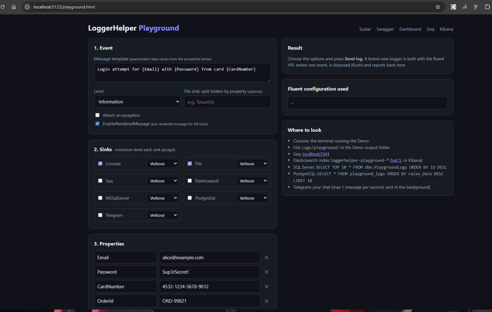
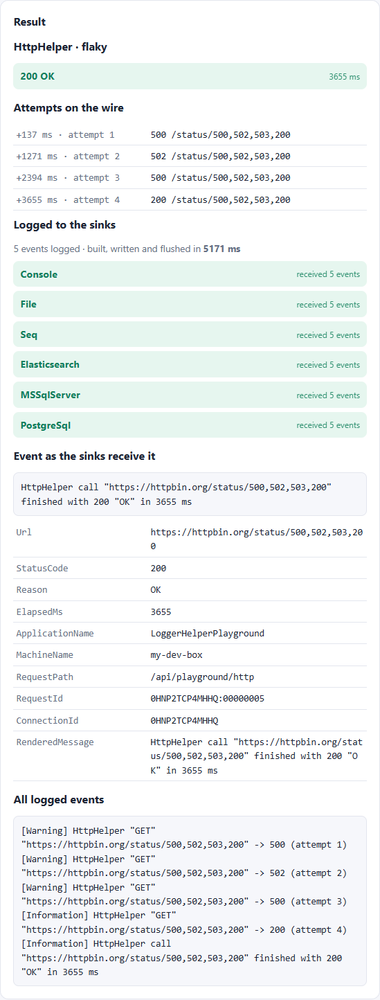
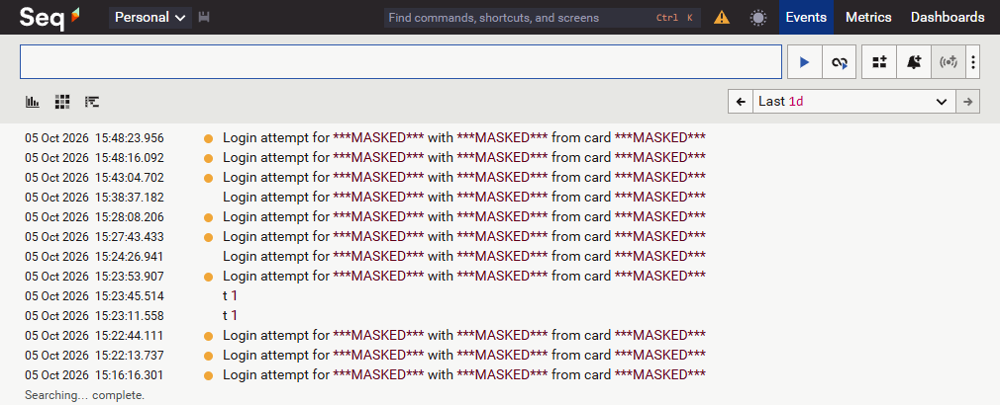

<a name="top"></a>
# 🧪 LoggerHelper Playground: every sink, one click

**Write one log event. Watch it land in Console, File, Seq, Elasticsearch, SQL Server, PostgreSQL and Telegram, already masked and already routed by level.**
**Call a real API through HttpHelper. Watch every retry, timeout and rate-limit hit become a log event in those same sinks.**

The Playground is an interactive page inside the Demo app. You choose the sinks, the minimum level for each one, the message, the properties and the masking rules. You press **Send log**, and LoggerHelper builds a fresh pipeline with the **fluent API**, writes the event, flushes every sink and tells you exactly what happened. Press **Call API**, and **HttpHelper** calls [httpbin.org](https://httpbin.org) for real, with Polly retries, timeouts, rate limiting and Bearer auth, logging every attempt.

No JSON to edit, no restart, no guessing.



---

## Table of Contents

- [What you will see in 2 minutes](#what-you-will-see)
- [1. Start the infrastructure (Docker)](#start-docker)
- [2. Run the Demo](#run-demo)
- [3. Tour of the page](#tour)
- [4. HttpHelper: real calls to a free API](#httphelper)
- [5. Seven experiments to try](#experiments)
- [6. Check the data in each sink](#check-sinks)
- [7. Under the hood](#under-the-hood)
- [Troubleshooting](#troubleshooting)
- [Clean up](#clean-up)

---

<a name="what-you-will-see"></a>
## ✨ What you will see in 2 minutes

| You do | LoggerHelper does |
|---|---|
| Tick the sinks and press **Send log** | Builds a new logger with `AddRoute` + `Configure<Sink>`, writes one event, flushes all of them |
| Set PostgreSQL to `Error` and send a `Warning` | PostgreSQL shows **filtered**, the other sinks show **received** |
| Put `Sup3rSecret!` in a `Password` property | Every sink receives `***MASKED***`, in the property **and** in the rendered message |
| Stop the Seq container and send again | The app keeps working; the error appears in the result panel, the other sinks still write |
| Add a `TenantId` property and set it as file folder | The File sink writes to `Logs/playground/acme/` |
| Pick **Flaky upstream** and press **Call API** | HttpHelper calls httpbin.org for real and retries 500 → 502 → 500 → 200; every attempt is a log event in every sink |
| Pick **Bearer auth** | The token goes to the API, but every sink logs `Authorization: Bearer ***MASKED***` |
| Pick **Rate limit** with 5 calls and 2 permits | 2 calls go through, 3 get `429` from HttpHelper itself, without touching the network |

[↑ Back to Top](#top)

---

<a name="start-docker"></a>
## 1. Start the infrastructure (Docker)

**Prerequisites:** [.NET SDK](https://dotnet.microsoft.com/download) 8, 9 or 10 and [Docker Desktop](https://www.docker.com/products/docker-desktop/) with **at least 4 GB of memory free for these containers, 6 GB with Kibana** (SQL Server and Elasticsearch take about 1.5 GB each). On Windows the limit is `memory=` in `%USERPROFILE%\.wslconfig`: see [Troubleshooting](#troubleshooting).

**Step 1: create your `.env` before the first start.** It holds the database passwords. **Copy** the template, don't rename it: `.env.example` stays in git as the template, your `.env` is git-ignored and never leaves your PC.

```bash
cd src/CSharpEssentials.LoggerHelper.Demo/docker
cp .env.example .env
```

On Windows PowerShell you can also use `Copy-Item .env.example .env`. Change the passwords now if you want: SQL Server and PostgreSQL read them **only the first time** their volume is created (see the note below the table).

**Step 2: start everything.** One command starts SQL Server, PostgreSQL, Seq and Elasticsearch, with volumes and health checks:

```bash
docker compose up -d
docker compose ps
```

Wait until every service says **healthy**. The first start of SQL Server takes 2 to 3 minutes because it upgrades its system databases; after that it is fast.

Want Kibana too? It is optional and needs about 1 GB more. A plain `docker compose up -d` never starts it: always pass the profile.

```bash
docker compose --profile kibana up -d
```

| Service | Address | Notes |
|---|---|---|
| SQL Server | `127.0.0.1:11433` | database `LoggerHelperPlayground` created on first start |
| PostgreSQL | `127.0.0.1:15432` | database `loggerhelper_playground` |
| Seq | http://127.0.0.1:5341 | UI and ingestion, no login |
| Elasticsearch | http://127.0.0.1:9200 | security disabled (local demo only) |
| Kibana | http://127.0.0.1:5601 | only with `--profile kibana` |

Log tables are created by the sinks themselves (`AutoCreateSqlTable`, `NeedAutoCreateTable`) on the **first log** sent to that sink, not when the container starts: an empty database before your first **Send log** is normal.

> 🔐 The passwords in `.env.example` are local demo values. `.env` is git-ignored. If you change them, update the `Playground` section of `src/CSharpEssentials.LoggerHelper.Demo/appsettings.json` too.
> Changing a password **after** the first start has no effect on the running databases: recreate the volumes with `docker compose down -v` and `docker compose up -d` (this deletes the stored logs).

More details: [`docker/README.md`](src/CSharpEssentials.LoggerHelper.Demo/docker/README.md).

[↑ Back to Top](#top)

---

<a name="run-demo"></a>
## 2. Run the Demo

```bash
cd src/CSharpEssentials.LoggerHelper.Demo
dotnet run
```

Open **http://localhost:5123**: the root opens the Playground.

The same app also gives you:

| URL | What |
|---|---|
| `/playground.html` | the Playground |
| `/scalar` | Scalar API reference, try every endpoint from the browser |
| `/swagger` | Swagger UI, same endpoints |
| `/loggerhelper` | LoggerHelper Dashboard: loaded sinks, errors, live logs |

> No Docker? Tick only **Console** and **File**: they need nothing else.

**Optional: Telegram.** A bot token is a secret, so it never goes into the page or into git. Put it in user-secrets and restart the Demo; the **Telegram** checkbox turns on by itself:

```bash
cd src/CSharpEssentials.LoggerHelper.Demo
dotnet user-secrets set "Playground:Telegram:BotToken" "<your-bot-token>"
dotnet user-secrets set "Playground:Telegram:ChatId" "<your-chat-id>"
```

Getting the two values takes 3 minutes:

1. **Bot token**: in Telegram open [@BotFather](https://t.me/BotFather), send `/newbot`, choose a name and a username ending in `bot`. BotFather replies with the token (`123456789:AAH...`). Keep it secret.
2. **Say hello first**: open the chat with your new bot and press **Start**. A bot cannot write to someone who never wrote to it.
3. **Your chat id**: open `https://api.telegram.org/bot<TOKEN>/getUpdates` in the browser and look for `"chat":{"id":123456789,...}`. That number is the ChatId. If you see `"result":[]`, send another message to the bot and reload. For a group, add the bot to the group, write there, and use the negative id (`-100...`).

User-secrets are read at startup: after setting them, stop the Demo with **Ctrl+C** and run `dotnet run` again. The Telegram sink sends one message per second at most and sends it in the background.

[↑ Back to Top](#top)

---

<a name="tour"></a>
## 3. Tour of the page

**Left: what you send**

1. **Event**: the message template (`{Email}`, `{Password}`... become structured properties), the level, an optional exception, `EnableRenderedMessage` on or off, and an optional property name to split File output into folders.
2. **Sinks**: one checkbox per sink plus the **minimum level** that sink accepts. This becomes `AddRoute("Seq", Warning, Error, Fatal)` and so on.
3. **Properties**: name/value pairs. Values matching a placeholder fill the message; the others are attached as extra properties.
4. **Sensitive data masking**: built-in presets (Email, CreditCard, JwtToken, BearerToken, ConnectionStringSecret), sensitive property names, custom regex rules, and the mask text.
5. **HttpHelper**: a scenario, retries, backoff, timeout, Bearer token and rate-limit burst. **Call API** uses the sinks and masking chosen above.

**Right: what LoggerHelper did**

- **Result**: every sink with its outcome (**received**, **filtered** by level, or **configuration failed**), the time to build, write and flush, and any sink error.
- **Event as the sinks receive it**: the rendered message and every property **after** masking. This is the exact event your sinks got.
- **Fluent configuration used**: the C# you would write to get the same pipeline.
- **Where to look**: one-liners to find the event in each sink.

[↑ Back to Top](#top)

---

<a name="httphelper"></a>
## 4. HttpHelper: real calls to a free API

`CSharpEssentials.HttpHelper` is the most downloaded package of the family, and here it talks to the real internet. Every scenario calls [httpbin.org](https://httpbin.org), a free API built for testing HTTP clients, through an `httpsClientHelper` configured on the fly. Each attempt on the wire becomes a log event on the Playground logger, so it reaches the sinks you ticked, masked.

```
Browser  ──POST /api/playground/http──▶  Demo (C#, HttpHelper)  ──HTTPS──▶  httpbin.org
                                             └── logs every attempt ──▶  your sinks
```

The page never calls httpbin.org itself: it sends your choices to the Demo, and the Demo's C# code calls the API through HttpHelper, exactly like your own backend would.



| Scenario | httpbin call | What you see |
|---|---|---|
| **Success** | `GET /get` | One attempt, `200`, the echoed request (with HttpHelper's `X-Retry-Attempt` header when retries > 0) |
| **Flaky upstream** | `GET /status/500,502,503,200` (random) | Polly retries on 5xx until a `200` or until retries run out; one `Warning` per failed attempt |
| **Upstream down** | `GET /status/503` | Every retry fails, the final `Error` says how long it took |
| **Timeout** | `GET /delay/<timeout + 2>` (httpbin max 10 s, so keep the timeout under 8 s) | HttpHelper turns the timeout into a `408` (retried too), no exception thrown at you |
| **Bearer auth** | `GET /bearer` | httpbin confirms the token; the logs show `Bearer ***MASKED***` (BearerToken preset) |
| **POST JSON** | `POST /post` | The JSON body echoed back, sent with `JsonContentBuilder` |
| **Rate limit** | `GET /get` × burst | A sliding-window limiter lets N calls through per 10 s; the rest get `429` locally |

Retries apply to 5xx and 408. The wait between attempts is `backoff ^ attempt` seconds, as in `addRetryCondition`.

> Offline or behind a proxy? Run httpbin locally (`docker run -p 8080:80 kennethreitz/httpbin`) and set `Playground:HttpBaseUrl` to `http://127.0.0.1:8080` in `appsettings.json`.

[↑ Back to Top](#top)

---

<a name="experiments"></a>
## 5. Seven experiments to try

### 🎭 1. Masking that really protects every sink
Keep the default message `Login attempt for {Email} with {Password} from card {CardNumber}` and press **Send log**.
Email and card are caught by presets, `Password` by name, `ORD-99821` by the custom regex `ORD-\d+`. The `RenderedMessage` stored by database sinks is masked too.
Now untick **EnableSensitiveDataMasking** and send again: same code path, secrets in clear. That is the difference one option makes.

### 🎯 2. Level routing per sink
Set **PostgreSql** to `Error`, keep the event at `Warning`, send. PostgreSQL turns orange (**filtered**), the others are green. Change the event to `Error`: now PostgreSQL receives it too.

### 💥 3. A sink goes down, your app does not
```bash
docker compose stop seq
```
Send a log. The request still succeeds, Console/File/databases still write, and the **Errors** list shows why Seq could not be reached. Bring it back with `docker compose start seq`.

### 🗂️ 4. One folder per tenant
Add a property `TenantId = acme` and write `TenantId` in **File sink: split folders by property**. Send with File ticked: the event goes to `Logs/playground/acme/log-<date>.txt`.

### 🧯 5. Exceptions everywhere
Tick **Attach an exception**, choose `Error`, send. The stack trace reaches every sink: the `Exception` column in SQL Server, `exception` in PostgreSQL, the exception panel in Seq.

### 🔁 6. A flaky API, tamed
Tick Seq and Elasticsearch, choose **Flaky upstream**, keep 3 retries and press **Call API**. The timeline shows each attempt on the wire (`500`, `502`... `200`), and Seq shows the same attempts as `Warning`s followed by the final outcome. Set retries to `0` and run it again to compare. Then try **Bearer auth**: the API gets the real token, the logs never do.

### 📲 7. An alert on your phone
With Telegram configured (see [Run the Demo](#run-demo)), route only `Error` and above to Telegram, choose **Upstream down** and press **Call API**. The final `Error` reaches your chat; the `Warning`s for each retry do not. The same routing works for **Send log** with level `Error` or `Fatal`.

[↑ Back to Top](#top)

---

<a name="check-sinks"></a>
## 6. Check the data in each sink



| Sink | Where |
|---|---|
| Console | the terminal where you ran `dotnet run` (or the console window Visual Studio opens), colored by level. A Demo started in the background shows nothing: use File or Seq |
| File | `src/CSharpEssentials.LoggerHelper.Demo/Logs/playground/` |
| Seq | http://127.0.0.1:5341 |
| Elasticsearch | JSON: http://127.0.0.1:9200/loggerhelper-playground-*/_search?sort=@timestamp:desc&size=5, UI: Kibana (see below) |
| SQL Server | `SELECT TOP 10 * FROM dbo.PlaygroundLogs ORDER BY Id DESC` |
| PostgreSQL | `SELECT * FROM playground_logs ORDER BY raise_date DESC LIMIT 10` (database `loggerhelper_playground`, not `postgres`) |

**Elasticsearch in Kibana.** Elasticsearch has no UI of its own; Kibana is it. Start it with `docker compose --profile kibana up -d`, wait a minute or two, then:

1. Open http://127.0.0.1:5601.
2. Menu ☰ → **Discover** → **Create data view**.
3. Name and index pattern: `loggerhelper-playground-*`; timestamp field: `@timestamp` → **Save**.
4. Set the time range (top right) to **Last 24 hours**. Every event is there, with its fields on the left (`level`, `fields.Action`, the masked `fields.Password`...).

**Connect with a client** (SSMS, Azure Data Studio, pgAdmin, DBeaver):

| | SQL Server | PostgreSQL |
|---|---|---|
| Server / Host | `127.0.0.1,11433` (comma, not colon) | `127.0.0.1`, port `15432` |
| Authentication | SQL Server Authentication (not Windows) | password |
| User | `sa` | `postgres` |
| Password | `MSSQL_SA_PASSWORD` in `docker/.env` | `POSTGRES_PASSWORD` in `docker/.env` |
| Database | `LoggerHelperPlayground` | `loggerhelper_playground` |
| Encryption | Mandatory + **Trust server certificate** (self-signed) | default |

> Plain `localhost` or port `1433`/`5432` would reach a SQL Server or PostgreSQL installed on your PC, not the containers.

Or query the databases from the containers (run these in the `docker` folder), no client needed:

```bash
docker compose exec postgres psql -U postgres -d loggerhelper_playground -c "SELECT level, message FROM playground_logs ORDER BY raise_date DESC LIMIT 5"
```

```bash
docker compose exec sqlserver bash -c '/opt/mssql-tools18/bin/sqlcmd -C -S localhost -U sa -P "$MSSQL_SA_PASSWORD" -d LoggerHelperPlayground -Q "SELECT TOP 5 Level, Message FROM dbo.PlaygroundLogs ORDER BY Id DESC"'
```

### 🧱 Go further: enrichment and your own columns

Every property in **3. Properties** that is not a placeholder of the message is added to the event as **enrichment**, exactly like `BeginScope` or `BeginTrace` do in your app. Try it: add `Action = Checkout` and `IdTransaction = TX-2026-001`, tick PostgreSQL and send. They land in the `"Action"` and `"IdTransaction"` columns, which are part of the PostgreSQL sink's default schema:

```bash
docker compose exec postgres psql -U postgres -d loggerhelper_playground -c 'SELECT "ApplicationName", "Action", "IdTransaction", message FROM playground_logs ORDER BY raise_date DESC LIMIT 5'
```

How to enrich your own logs (`BeginTrace`, `BeginScope`, `WithEnrichers`): see [Enrichment in the README](README.md#enrichment).

In a real app you usually also want a property such as `TenantId`, `OrderId` or `UserId` in its **own column**, indexed and easy to filter, instead of inside the JSON properties:

- **SQL Server**: `AdditionalColumns` maps a log property to a dedicated SQL column → [Custom Columns in the MSSqlServer sink](src/CSharpEssentials.LoggerHelper.Sink.MSSqlServer/README.md#custom-columns--map-log-properties-to-sql-columns)
- **PostgreSQL**: `Columns` defines the table schema, including single-property columns → [Custom Columns in the PostgreSQL sink](src/CSharpEssentials.LoggerHelper.Sink.Postgresql/README.md#custom-columns--replicate-or-extend-the-default-schema)

[↑ Back to Top](#top)

---

<a name="under-the-hood"></a>
## 7. Under the hood

Each **Send log** runs this, built from your choices ([`PlaygroundEndpoints.cs`](src/CSharpEssentials.LoggerHelper.Demo/Endpoints/PlaygroundEndpoints.cs)):

```csharp
var services = new ServiceCollection();
services.AddLoggerHelper(b => {
    b.WithApplicationName("LoggerHelperPlayground")
     .EnableRenderedMessage()
     .AddRoute("Seq", LogEventLevel.Warning, LogEventLevel.Error, LogEventLevel.Fatal)
     .AddRoute("PostgreSql", LogEventLevel.Error, LogEventLevel.Fatal)
     .ConfigureSeq(s => s.ServerUrl = "http://127.0.0.1:5341")
     .ConfigurePostgreSql(p => { p.ConnectionString = "..."; p.TableName = "playground_logs"; })
     .EnableSensitiveDataMasking(o => {
         o.Presets = ["Email", "CreditCard"];
         o.SensitiveProperties = ["Password"];
     });
});

using var sp = services.BuildServiceProvider();
var logger = sp.GetRequiredService<Serilog.ILogger>();
logger.Write(level, exception, message, args);
(logger as IDisposable)?.Dispose();   // flushes every batching sink
```

Each **Call API** adds HttpHelper on top of the same logger ([`PlaygroundHttpEndpoints.cs`](src/CSharpEssentials.LoggerHelper.Demo/Endpoints/PlaygroundHttpEndpoints.cs)):

```csharp
var helper = new httpsClientHelper(client, events, rateLimit)
    .addTimeout(TimeSpan.FromSeconds(3))
    .addRetryCondition(r => (int)r.StatusCode >= 500 || r.StatusCode == HttpStatusCode.RequestTimeout,
                       retryCount: 3, backoffFactor: 1);

// every attempt on the wire, retries included, becomes a log event
helper.AddRequestAction((req, res, attempt, rateLimitWait) => {
    logger.Write(res.IsSuccessStatusCode ? LogEventLevel.Information : LogEventLevel.Warning,
                 "HttpHelper {Method} {Url} -> {StatusCode} (attempt {Attempt})",
                 req.Method.Method, req.RequestUri, (int)res.StatusCode, attempt + 1);
    return Task.CompletedTask;
});

using var res = await helper.SendAsync("https://httpbin.org/status/500,502,503,200", HttpMethod.Get);
```

Same packages, same plugins, same pipeline you get in your own app: the Playground only changes **who** chooses the options.

[↑ Back to Top](#top)

---

<a name="troubleshooting"></a>
## Troubleshooting

| Symptom | Fix |
|---|---|
| A container is not `healthy` | `docker compose logs <service>`; SQL Server needs 2 to 3 minutes the first time |
| `port is already allocated`, or a database is unreachable although healthy | Another service owns the host port (a local SQL Server or PostgreSQL, for example): change the port in `docker/.env` and in `appsettings.json` → `Playground` |
| A sink is slow on Windows | Use `127.0.0.1`, not `localhost`: `localhost` may try IPv6 first and wait for a timeout |
| SQL Server login fails | The SA password in `docker/.env` and in `appsettings.json` must match; it needs upper, lower, digit and symbol. Changed `.env` after the first start? Run `docker compose down -v` then `up -d` |
| SSMS cannot connect | Server `127.0.0.1,11433` (comma), SQL Server Authentication, user `sa`, **Trust server certificate** ticked |
| Elasticsearch exits | It runs with a 1 GB heap: give Docker more memory |
| Docker hangs (`docker ps` never answers, `500 Internal Server Error`) or Kibana gives `ERR_CONNECTION_RESET` | Docker ran out of memory. On Windows raise `memory=` in `%USERPROFILE%\.wslconfig` (e.g. `8GB`), quit Docker Desktop, run `wsl --shutdown`, start Docker Desktop again. Or leave Kibana off |
| `http://localhost:5123` refuses the connection | The Demo is not running: `dotnet run` in `src/CSharpEssentials.LoggerHelper.Demo` |
| No `playground_logs` table in PostgreSQL | Connect to port `15432` (not your local `5432`), database `loggerhelper_playground`, and send at least one log to PostgreSQL first |
| The first Elasticsearch write after `docker compose up` times out | Elasticsearch is still warming up; send again |
| **Call API** is slow or returns `502 Upstream error` | httpbin.org is a shared free service: retry, or run it locally (see [HttpHelper](#httphelper)) |
| The Telegram checkbox is greyed out | Set `Playground:Telegram:BotToken` and `ChatId` with `dotnet user-secrets` and restart the Demo |
| Telegram stays silent | Check the Dashboard (`/loggerhelper`) for Telegram API errors: they arrive after the response, because the sink sends in the background |

[↑ Back to Top](#top)

---

<a name="clean-up"></a>
## Clean up

```bash
docker compose down        # stop, keep the data
docker compose down -v     # stop and delete the data
```

---

Like what you saw? ⭐ [Star the repo](https://github.com/alexbypa/CSharp.Essentials) and install it in your app:

```bash
dotnet add package CSharpEssentials.LoggerHelper
```

[← Back to README](README.md)
